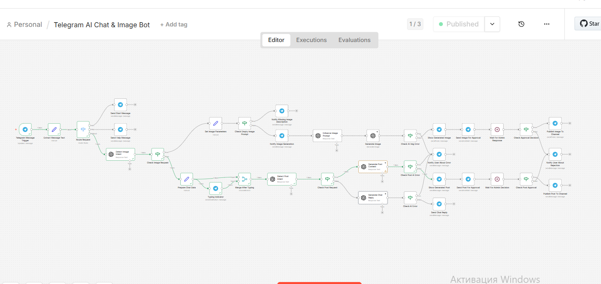
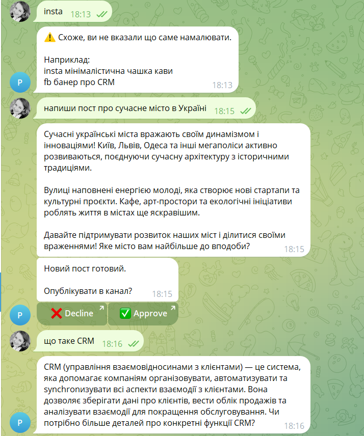
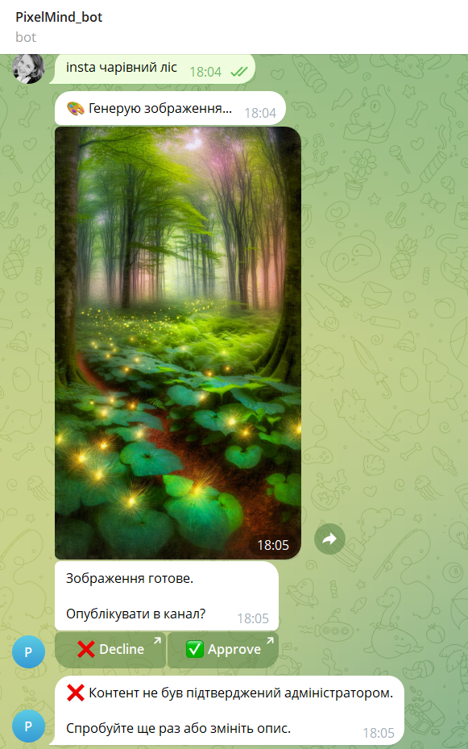
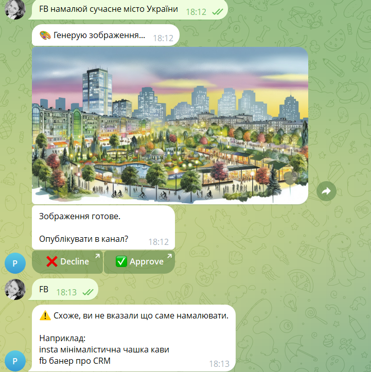

# AI Telegram Bot (Text + Image Generation)

Automation workflow built with n8n that generates AI text and images via Telegram.

## Workflow

## Telegram Interaction

## Image Generation

## Features

- AI text generation
- AI image generation
- Telegram bot integration
- admin approval system
- automated content publishing

## Technologies

- n8n
- Telegram Bot API
- AI Image Generation
- AI Text Generation
## Use Cases

This automation can be used for:

- social media content generation
- marketing content automation
- Telegram community management
- AI-powered chat assistants

---

## Author

Automation workflow developed as part of an AI and automation portfolio project.
