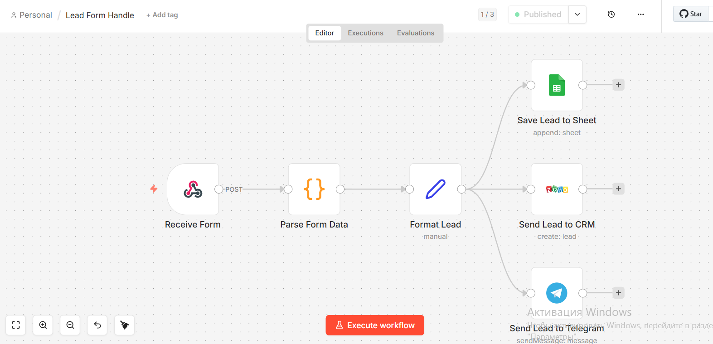
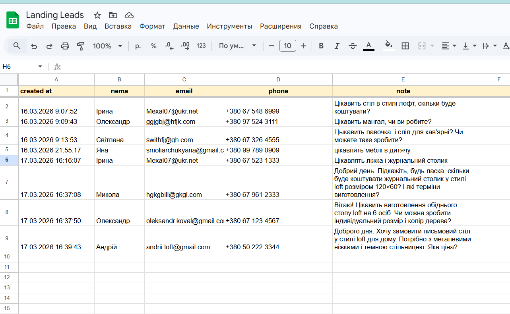
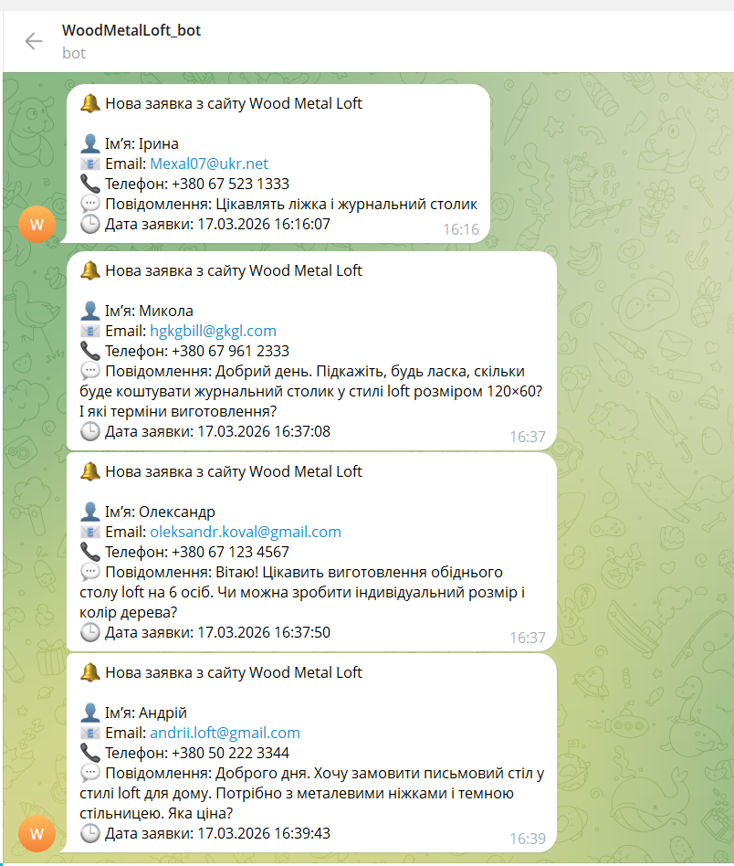
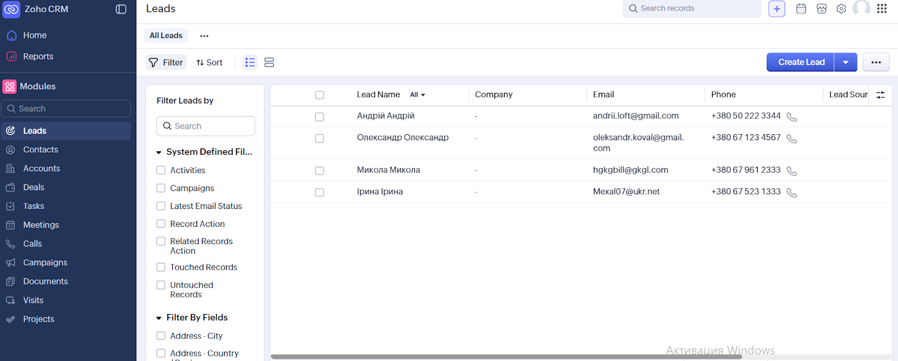

# Wix Lead Automation System

Automation workflow that captures leads from a website and distributes them across multiple systems in real time.

The system processes form submissions from a Wix website, structures the data, and automatically sends it to Google Sheets, Telegram, and Zoho CRM.

---

## Overview

This automation eliminates manual lead processing and ensures that every submission is instantly captured and delivered to the team.

The workflow:

- receives form data from Wix via webhook
- extracts and formats lead information
- stores leads in Google Sheets
- sends real-time notifications to Telegram
- creates leads in Zoho CRM

---

## Workflow

---

## Live Demo

- 🌐 Website: https://im0396859.wixsite.com/wood_metal_loft  
- 🤖 Telegram Bot: @WoodMetalLoft_bot  

---

## How It Works

1. A user submits a form on the website  
2. The form data is sent to the automation via webhook  
3. The workflow parses all form fields dynamically  
4. The data is structured into standard lead format  
5. The lead is sent to multiple systems simultaneously:

   - Google Sheets (data storage)
   - Telegram (instant notification)
   - Zoho CRM (lead management)

---

## Data Processing

The workflow performs several transformation steps:

- extracts form fields from Wix submission payload  
- maps fields (name, email, phone, message)  
- formats date and time automatically  
- normalizes phone number format  
- prepares structured data for all integrations  

---

## Integrations

### Google Sheets

All leads are stored in a structured table:

- created at  
- name  
- email  
- phone  
- message  

This acts as a simple lead database and history log.

---

### Telegram Notifications

Each new submission triggers an instant notification with full lead details:

- name  
- email  
- phone  
- message  
- submission time  

This allows immediate response to new leads.

---

### Zoho CRM Integration

Leads are automatically created in Zoho CRM, including:

- name  
- email  
- phone  
- message  

This ensures seamless integration with the sales pipeline.

---

## Technologies

- n8n (workflow automation)
- Wix Forms (lead source)
- Webhooks
- Google Sheets API
- Telegram Bot API
- Zoho CRM API

---

## Business Value

This automation provides:

- instant lead capture
- real-time notifications
- centralized data storage
- automatic CRM integration
- elimination of manual data entry

As a result, response time to new leads is significantly reduced and no leads are lost.
